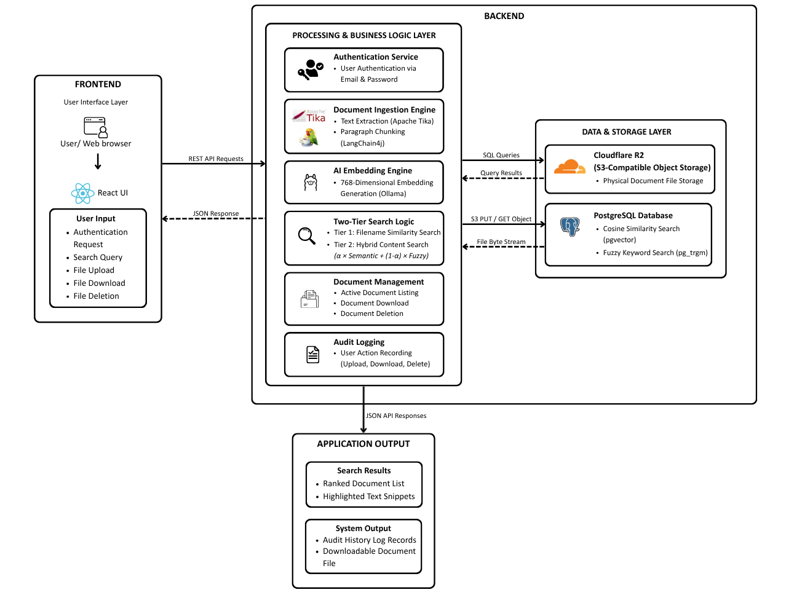
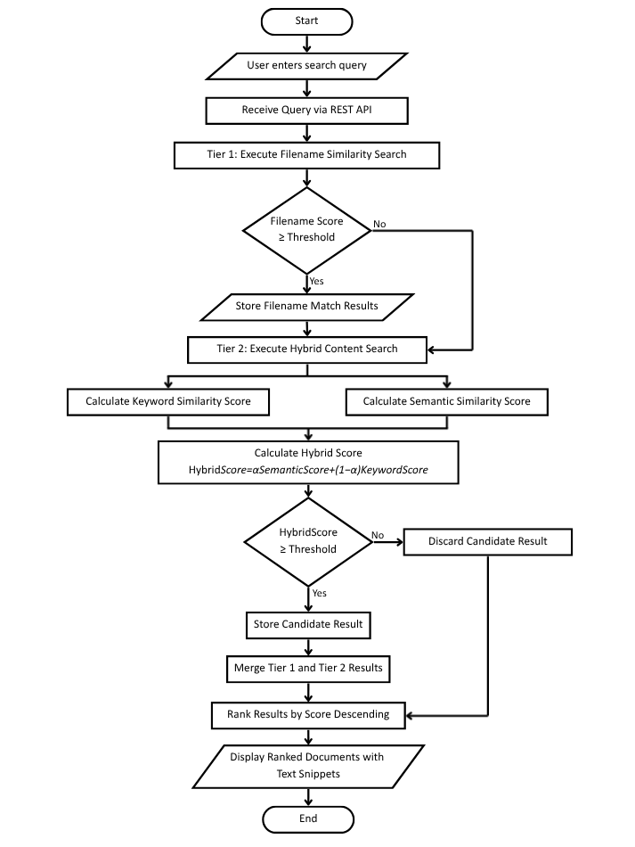
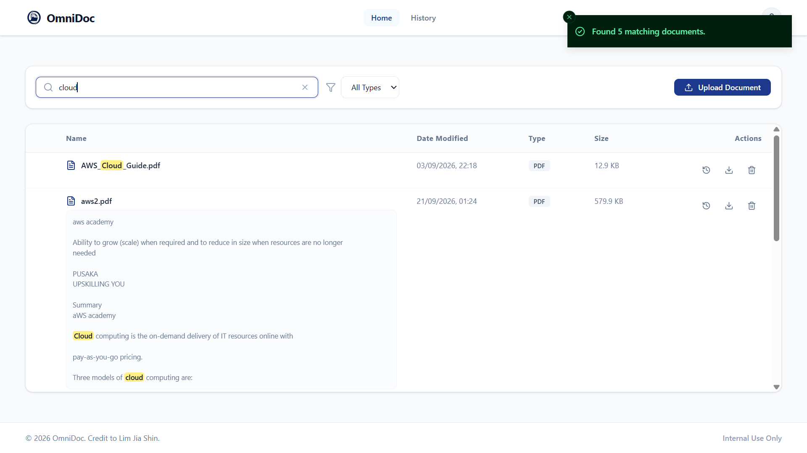
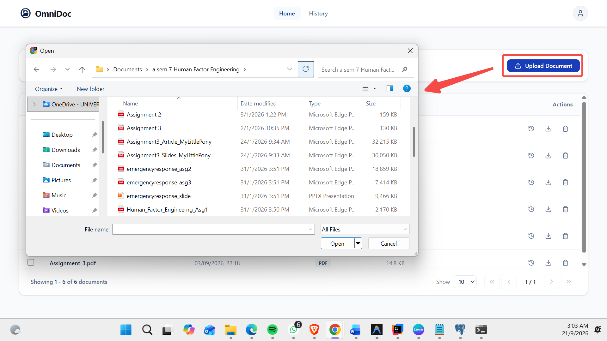

# OMNIDOC: AN AI-POWERED HYBRID DOCUMENT RETRIEVAL SYSTEM FOR INTELLIGENT CORPORATE KNOWLEDGE MANAGEMENT

**OmniDoc** is a secure, high-performance web application designed to help enterprises index, manage, and retrieve internal corporate knowledge effortlessly. It leverages a state-of-the-art **Retrieval-Augmented Generation (RAG)** pipeline to perform hybrid search, combining semantic meaning with keyword matching to deliver highly accurate document retrieval.

---

## Key Features
* **Hybrid Search Engine**: Combines filename similarity (`pg_trgm`) and deep semantic content understanding (`pgvector`).
* **Contextual Snippets**: Automatically highlights exact sentences within a document where the search query matches.
* **Intelligent Processing**: Extracts text from uploaded files, chunks the content, and generates vector embeddings using a local Ollama AI model.
* **Audit Logging**: Comprehensive activity tracking for every document upload, download, and deletion.

---

## System Architecture

---

## Search Workflow Algorithm

---

## User Interface

### 1. Main Dashboard & Hybrid Search

### 2. Document Management & Upload

---

## Tech Stack
* **Frontend**: React 19 (Vite), TypeScript, Tailwind CSS v4, shadcn/ui
* **Backend**: Spring Boot 3 (Java 17), LangChain4j, Apache Tika
* **Database & Storage**: PostgreSQL (`pgvector`, `pg_trgm`), Cloudflare R2
* **AI Engine**: Local Ollama Server (`paraphrase-multilingual` model)
